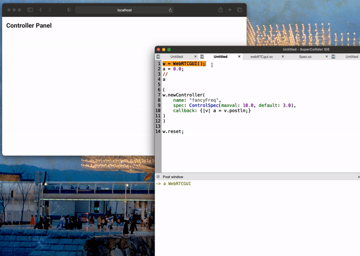
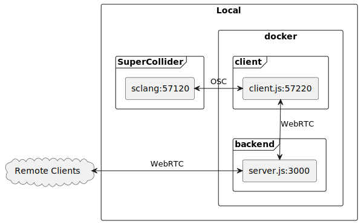
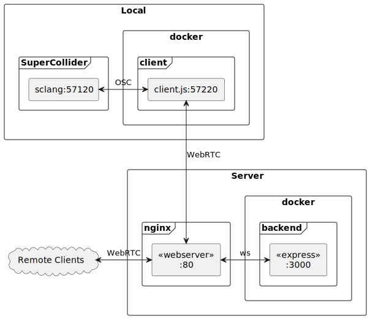
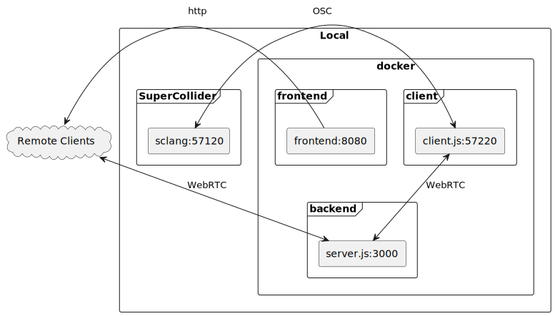

# webRTCgui

*webRTCgui* allows to create dynamic GUI elements in the internet or local network from within SuperCollider.
Clients get synced among each other and movements in the GUI gets also
forwarded to SuperCollider.



This GUI also syncs across multiple devices, also across the internet.

As SuperCollider can not directly communicate via WebRTC we need some translational layers.
To get a better understanding we quickly explain each component involved.

Service | Folder | Description
--- | --- | ---
Backend | `.` | A express server which distributes the necessary messages. Can run on your local machine or remote machine.
Frontend | `./frontend` | A frontend through which outside clients can interact. Should run on the same machine as the backend.
Client | `.` | Client to translate WebRTC to SuperCollider OSC messages. Needs to run on your local machine.
SuperCollider | `./webRTCgui` | A simple Quark with the class `WebRTCGUI`. Should be used on your local machine.

## Installation

### SuperCollider

Before we start with setting up the services you should install the necessary Quark in SuperCollider by entering the following lines into the editor and evaluate them.

```supercollider
Quarks.install("https://github.com/capital-G/webRTCgui.git");
// recompile interpreter to make new classes available
thisProcess.platform.recompile;
```

### Services

The easiest way to set up all necessary services is using [Docker](https://docs.docker.com/get-docker/) with [docker-compose](https://docs.docker.com/compose/install/).
If you do not want to use Docker take a look at `Dockefile` and `docker-compose.yml` to get a sense on the port mappings and build processes.

### Use on local machine for local network

The easiest way to try this setup is by running everything on your local machine.
Simply clone the repository by executing the following line within a terminal and a folder of your choice.

```sh
git clone https://github.com/capital-G/webRTCgui.git
```

Now we switch the directory to the just created folder

```sh
cd webRTCgui
```

We assume that SuperCollider is running on the default port `57120` which can be verified by running

```supercollider
NetAddr.langPort;
```

in the SuperCollider interpreter.
If these ports do not match up you will not receive any updates from the frontend in SuperCollider.
Check if any other `sclang` instances are running or modify the port in the `docker-compose.yml` file.

Now we can build and run the Docker containers by executing

```sh
docker-compose up --build
```

Once everything spun up you can access the frontend on <http://localhost:3000> and start creating controls from SuperCollider (see the Help Files in SuperCollider by searching for `WebRTCGUI`).

Other clients within your local network can access the website as well via `http://your_local_ip:3000`.

For the sake of completeness there is a schematic on how the services are connected.



### Use on remote machine for internet

Deploying the service on a remote machine allows you to connect globally to the GUI.
One of the nice things about WebRTC is that it can bypass some P2P obstacles such as IPv6 or a firewall, so most likely you do not have to worry about these things.

We assume that you run a linux server on which docker, docker-compose and nginx is already installed.

Start by cloning the repo on your remote machine

```sh
git clone https://github.com/capital-G/webRTCgui.git && \
cd webRTCgui
```

Spin up the remote setup via

```sh
docker-compose -f docker-compose.remote.yml up --build
```

You may add the flag `-d` to make the container run in the background.

Check via `curl -f http://localhost:3000` if the server is reachable.

If so we can now create and activate a nginx config.
It is also possible to use an Apache server but I don't have a config for it.

Here is an example of such a nginx config file.

```conf
server {
  server_name   my-domain.com;

  location / {
    proxy_pass  http://localhost:3000;
      proxy_set_header Host $host;
      proxy_set_header X-Real-IP $remote_addr;
      proxy_set_header X-Forwarded-For $proxy_add_x_forwarded_for;
      proxy_set_header X-Forwarded-Proto $scheme;
      add_header Strict-Transport-Security "max-age=31536000; includeSubDomains; preload";
      client_max_body_size 0;

      access_log /var/log/nginx/remote.access.log;
      error_log /var/log/nginx/remote.error.log;
  }
  listen 80;
}
```

Modify it according to your URL and port mappings, restart nginx and let [certbot](https://certbot.eff.org/) give you a certificate for your config.

Verify that you can access the backend server with your browser.

#### Connect te remote machine

Once we set up everything on the remote machine we need to connect our local client to the remote website.

Use the following command in which we prepend the URL and token of our remote service as environment variables which will passed to the service.

```sh
BACKEND_ADDRESS="https://my-domain.com" BACKEND_AUTH_TOKEN="my_token" docker-compose -f docker-compose.remote_client.yml up --build
```

If everything worked you should see

```log
client_1  | Connected to server
```

#### Schematic



### Authentication

To restrict the creation and deletion of GUI elements there needs to some kind of authentication to distinguish between the local client which is attached to SuperCollider and the remote clients, accessing the server via a browser.
You can use and modify the environment variable `BACKEND_AUTH_TOKEN` in both places of the `docker-compose.yml` file (or respectively any other docker-compose file) to change this token.
Please do not use precious passwords as these passwords are transmitted non-encrypted and may get spilled by storing and printing them in plaintext.

## Development

There is an additional docker-compose file `docker-compose.dev.yml` which allows for hot-reloading and debugging of the Vue frontend by using the Vue development server instead of shipping the static build via an Express server like on the normal build.

To use this server please install first all frontend dependencies first by running

```sh
cd frontend
npm install
```

as we will completely mount and replace the folder in the container with our local instance which would otherwise lack the necessary dependencies in `node_modules`.

To use the dev version simply run

```sh
docker-compose -f docker-compose.dev.yml up --build
```

The Vue development server is then available under <http://localhost:8080>.

Please install and setup [`pre-commit`](https://pre-commit.com/) before committing which will run some linting checks.

The schematics of the dev environment are a bit more complex.



## License

GPL-2
