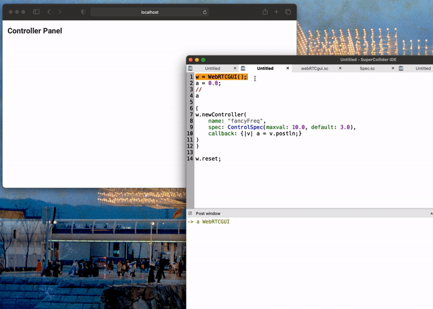
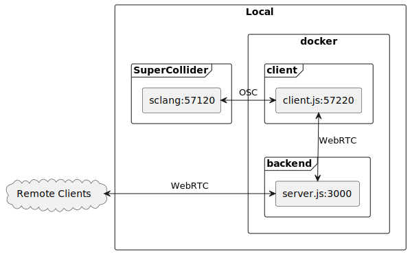
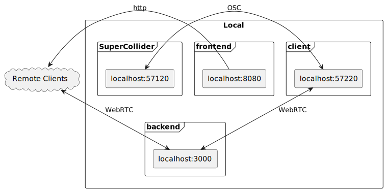

# webRTCgui

> *webRTCgui* allows to publish, modify and sync dynamic GUI elements / parameters via the internet (or local network) from within SuperCollider.



This GUI parameters syncs across multiple devices, also across the internet.

As SuperCollider can not directly communicate via WebRTC we need a translation layer to do the network lifting.
To get a better understanding we quickly explain each component involved.

Service | Folder | Description
--- | --- | ---
Server | `js/server.ts` | A express server which serves the frontend and distributes the necessary messages for communication. You can run this your local machine or on a remote machine (server) if you want to publish the GUI via the internet.
Frontend | `js/src` | A vue.js 3 frontend / website through which clients can interact and view the available parameters. Should run on the same machine as the backend and in default the server cares for this.
Client | `js/client.ts` | Our translation layer between SuperCollider OSC messages and the WebRTC server. This needs to run on your local machine.
SuperCollider | `./classes` | A simple Quark with the class `WebRTCGUI`. Should be used on your local machine.

## Setup

### SuperCollider

Before we start with setting up the services you should install the necessary Quark in SuperCollider by entering the following lines into the editor and evaluate them.

```supercollider
Quarks.install("https://github.com/capital-G/webRTCgui.git");
// recompile interpreter to make new classes available
thisProcess.platform.recompile;
```

### WebRTC

Clone the repository to a folder of your choice via

```shell
git clone https://github.com/capital-G/webRTCgui.git
cd webRTCgui
```

The easiest way to set up all necessary services is using [Docker](https://docs.docker.com/get-docker/) with [docker-compose](https://docs.docker.com/compose/install/).

#### Local server and client

> This assumes that sclang is started on port `57120` which can be verified by executing `NetAddr.langPort` or can be changed by setting e.g. `export SC_PORT=57121`.

In order to try it out on your local machine you can type

```shell
docker-compose up --build
```

Once everything spun up you can access the frontend on <http://localhost:3000> and start creating controls from SuperCollider by reading the docs

```supercollider
HelpBrowser.openHelpFor("Classes/WebRTCGUI")
```

Other users within your network can also access the website via `http://<your-local-ip>:3000`.

To understand the connections better here is a schematic on how the services are connected in a local setup.



#### Remote server and local client

Assuming you want to have the website accessible via the internet you need a remote machine on which you can to deploy the server on which you should run

```shell
# set a password for the server and start the server
BACKEND_AUTH_TOKEN=someBetterPassword \
docker-compose -f docker-compose.server.yml up --build
```

By appending a `-d` flag the service will start in the background.

Make sure you have setup the network properly so the service is reachable by either having port 3000 forwarded in your firewall (e.g. [`ufw`](https://wiki.archlinux.org/title/Uncomplicated_Firewall)) or setting up a reverse proxy (see below).
If you can see the website you have set it up properly.

After this you need to start the client on your local machine which acts as a translation layer between our local SuperCollider instance and the remote server.

```shell
# set the password and address from the server and start the local client
BACKEND_AUTH_TOKEN=someBetterPassword \
BACKEND_ADDRESS="http://my.ip:3000" \
docker-compose -f docker-compose.client.yml up --build
```

If everything worked it should say

```log
webrtcgui-client-1  | Connected to server
```

and from there on you can continue with the SuperCollider documentation (see above).

Here are the schematics for a remote workflow with reverse proxy.


### Setup a nginx reverse proxy

Using a reverse proxy allows you to secure the application better and also add supports for https certificates to the server which will improve usability across devices.

Here is an example of such a nginx config file which would redirect the traffic from `my-domain.com` to our server.

```conf
server {
  server_name   my-domain.com;

  location / {
    proxy_pass  http://localhost:3000;
      proxy_set_header Host $host;
      proxy_set_header X-Real-IP $remote_addr;
      proxy_set_header X-Forwarded-For $proxy_add_x_forwarded_for;
      proxy_set_header X-Forwarded-Proto $scheme;
      proxy_set_header Upgrade $http_upgrade;
      proxy_set_header Connection "Upgrade";

      add_header Strict-Transport-Security "max-age=31536000; includeSubDomains; preload";
      client_max_body_size 0;

      access_log /var/log/nginx/remote.access.log;
      error_log /var/log/nginx/remote.error.log;
  }
  listen 80;
}
```

Modify it according to your URL and port mappings, restart nginx and let [certbot](https://certbot.eff.org/) give you a certificate for your config.

After this you can verify that you can access the server with your browser which should display the frontend website.

### Authentication

> Please do not use precious passwords as these passwords are transmitted non-encrypted and may get spilled by storing and printing them in plaintext.

To restrict the creation and deletion of GUI elements there needs to some kind of authentication to distinguish between the local client which is attached to SuperCollider and the remote clients, accessing the server via a browser.
You can set the environment variable `BACKEND_AUTH_TOKEN` in the server and client shell to the desired password, e.g.

```shell
export BACKEND_AUTH_TOKEN=somePassword
```

## Development

For development we do not rely on the docker environment because it is rather nasty to sync the `node_modules` folder between container and host machine.
Currently this project uses Node 14 with typescript which makes the development of the communication much more safe as we use type checks on the messages we send and receive.

To install all necessary dependencies execute

```shell
cd js
npm install
```

and start the setup via

```shell
npm run local-dev
```

The Vue development server is then available under <http://localhost:8080>, the server starts under port `3000`.

Please install and setup [`pre-commit`](https://pre-commit.com/) before committing which will run some linting checks.

The schematics of the dev environment.



## License

GPL-2
